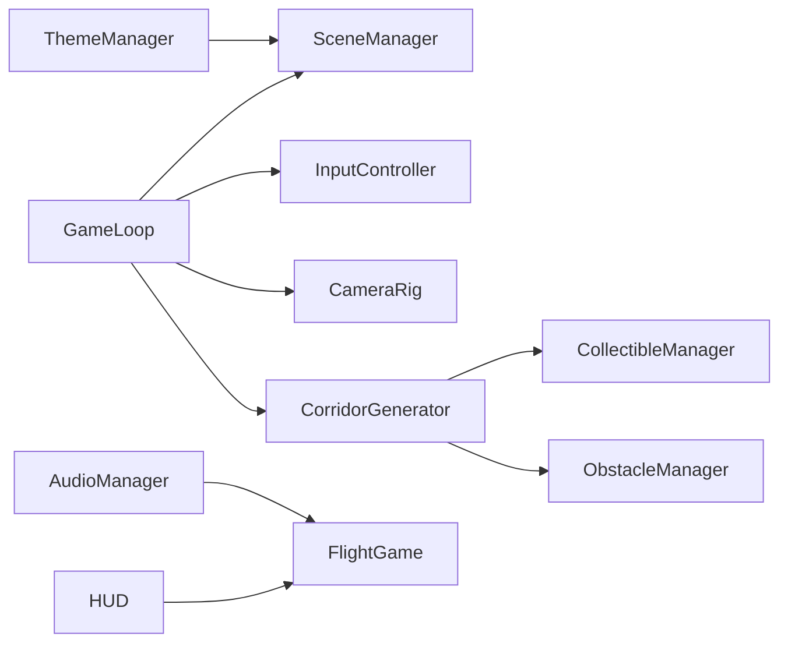

# Dream Surfer — Product Requirements & Build Plan

This document merges the product vision (PRD) with the technical implementation plan for the browser-first prototype.

---

## Part A — Product vision (summary)

**Codename:** Dream Surfer  

**Goal:** Ultra-light, hypnotic procedural flying game — MilkDrop-meets-tunnel-ride, Subway Surfers simplicity, Sonic flow, dreamlike meditation. Feeling-first: instant immersion, high speed / low stress, minimal learning curve, short sessions.

**Stack (phase 1):** Vite, React, TypeScript, Three.js, custom GLSL, Howler.js (global/volume + optional clips), browser-first responsive; Capacitor/Unity only after MVP validation.

**MVP mission:** In ~30 seconds, does flying feel mesmerizing? (Not monetization, narrative, or progression depth.)

**Core loop:** Tap start → immediate forward acceleration → steer (drag) → collect rings/crystals → avoid obstacles → boost gates / chain boosts → crash or end → instant restart.

**Controls:** Finger drag = horizontal + vertical steering; constant forward thrust; soft invisible corridor bounds.

**Camera (critical):** Smoothed follow, roll on turns, pitch on vertical motion, FOV widen on boost, speed shake, near-miss pulse, chromatic-style punch on boost/accel (implemented as lightweight post where feasible).

**World:** Procedural spline corridor, shader-driven backdrop (noise, FBM, emissive palettes), three theme presets per run (sunset ocean, aurora canyon, neon tunnel), pooled spawns and chunk recycling.

**Audio:** Ambient bed, collect chimes, boost whoosh, damped crash; room for reactive gain on boost.

**Performance:** Cap DPR (~2), pooling mandatory, target 60 FPS on mid-tier phones.

---

## Part B — Repository layout

```
src/
  engine/
    SceneManager.ts
    GameLoop.ts
    InputController.ts
    CameraRig.ts
    FlightGame.ts
  world/
    CorridorGenerator.ts
    ThemeManager.ts
    ObstacleManager.ts
    CollectibleManager.ts
  shaders/
    sky.glsl
    terrain.glsl
    boost.glsl
    fog.glsl
  audio/
    AudioManager.ts
  ui/
    HUD.tsx
    StartScreen.tsx
    EndScreen.tsx
  App.tsx
  main.tsx
```

Note: Three.js materials require vertex + fragment strings at runtime. Shader files are organized as listed; where a single stage is insufficient, companion `*.vert.glsl` / `*.frag.glsl` snippets are concatenated or paired in code from the same folder.

---

## Part C — Module build order (sequential sessions)

1. Three.js scene setup  
2. Forward camera / path motion  
3. Player drag steering  
4. Corridor bounds  
5. Ring spawning + collection (pooled)  
6. Obstacle spawning + crash  
7. Score + combo + HUD  
8. Camera polish (FOV, roll, pitch, shake, near-miss)  
9. GLSL world + `ThemeManager` (3 presets)  
10. Audio integration  
11. Boost (gates + chain), shader/audio hooks  
12. Mobile optimization (DPR cap, particle limits)

---

## Part D — MVP acceptance checklist

- Launch → start → immediate flight in procedural corridor  
- Collect rings with feedback (visual + audio)  
- At least one boost (gate and/or collectible chain)  
- Obstacles, crash, restart with low friction  
- Cohesive audiovisual “surf” feel  

**Out of scope for MVP:** leaderboards, meta progression, gyro, storefront, native wrapper.

---

## Part E — Architecture (runtime)



`FlightGame` owns run state (`menu` | `playing` | `crashed`), score, combo, boost timers, and wires React UI callbacks.

---

## Part F — Deployment

- **GitHub:** Source of truth for CI and Vercel.  
- **Vercel:** Connect the GitHub repo; framework preset **Vite**; build `npm run build`, output `dist`.  
- Environment: static SPA only; no server secrets required for MVP.

---

## Part G — Risks / notes

- Keep player collision proxy simple (sphere vs collectibles / obstacles).  
- Add heavy post-processing only after base motion is stable; prefer uniform-driven “burst” over full-screen stack on low-end devices.  
- Unlock Howler/WebAudio on first user gesture (browser autoplay policy).
